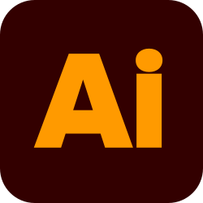
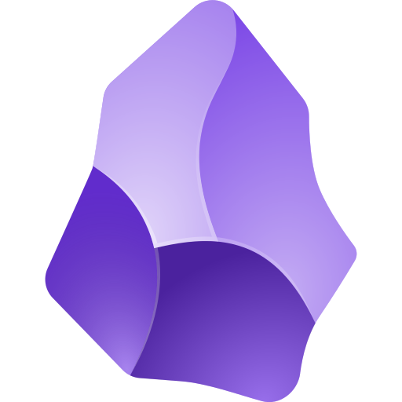

### AI · Software Development · Design

I'm a student working across AI, software development, and design,
turning real-world challenges into useful products.

---

## About Me

I enjoy visiting real workplaces, listening to people,
and turning their challenges into useful products.

I'm especially interested in improving construction workflows
and supporting local communities through technology and design.

## Projects

| Project | What I'm Building |
| :--- | :--- |
| [Construction Scheduling App](https://github.com/mhinata2010-wq/digital-gantt-chat) | A collaborative app for sharing schedules, visualizing task dependencies, and understanding the impact of delays. |
| RaiLive | A sensor- and AI-powered concept for detecting water leaks, condensation, and other building abnormalities early. |
| FRC Team Hanabi | Robotics challenges and partnerships that support our team. |

## Interests

- AI-powered products
- UI/UX and product design
- Collaborative software
- AI and hardware
- Construction technology and local communities

## My Approach

Build small. Test with real users. Improve through feedback.

## My Contribution Journey 🐍

  
  
  
  
  
  
  
  
  
  
  
  
  
  
  
   

